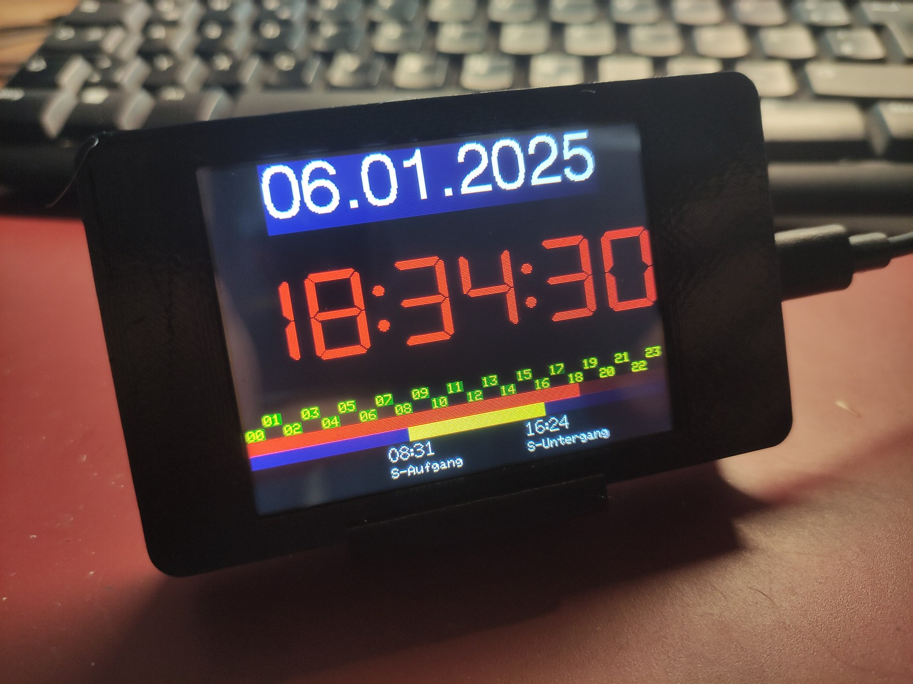
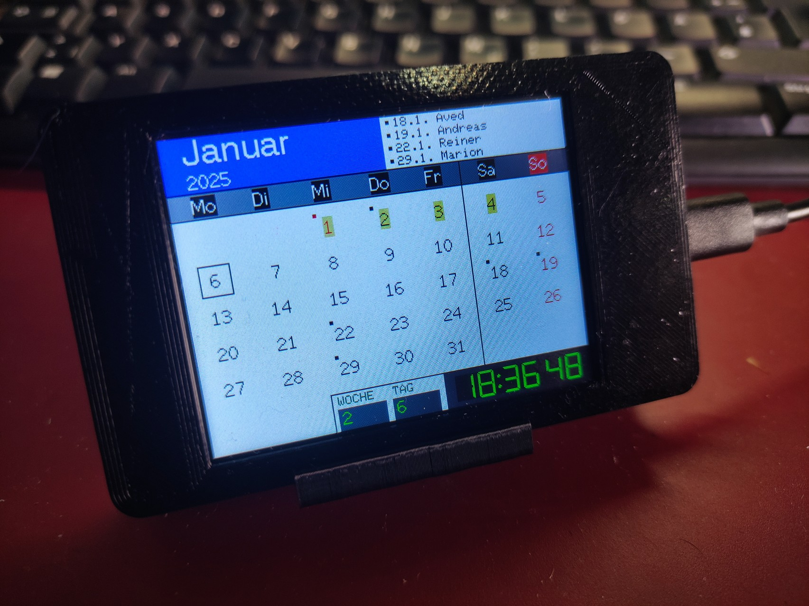
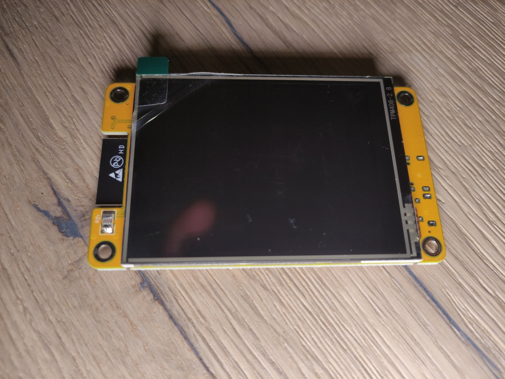
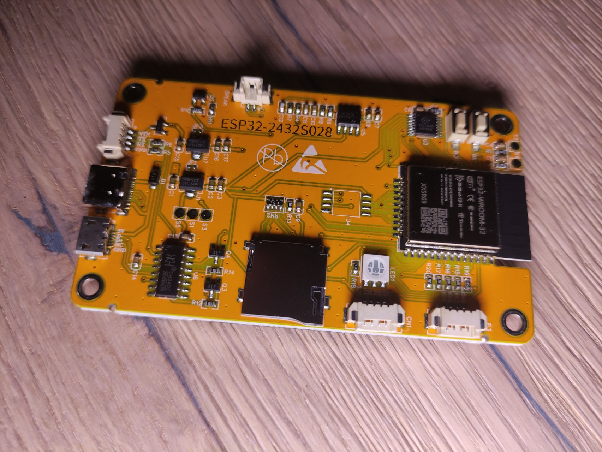
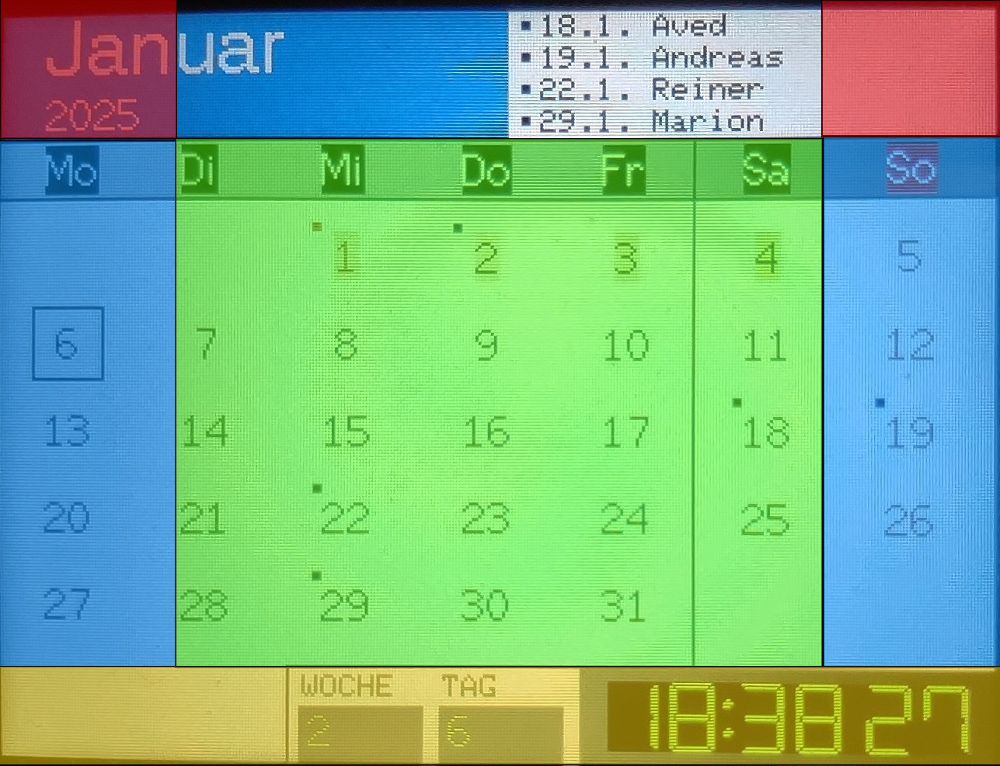

# w_Display_CYD
A calendar on a CYD (ESP32-Cheap-Yellow-Display)

[Deutsche Version](README.md)

## Calendar on an ESP32-Cheap-Yellow-Display:
This project is based on Arduino and runs on an ESP32 microcontroller.  
It is very easy to build as the project uses ready-made components  
that can be implemented without soldering.

## Features:
 - Display of public holidays.
 - Display of birthdays or other anniversaries.
 - Display of school holidays.
 - Configuration via config.txt file on a micro SD card.
 - Display of a clock with sunrise and sunset times.
 - Freely configurable for other time zones and locations (SD card).

  

## Hardware Tutorial:
- https://randomnerdtutorials.com/cheap-yellow-display-esp32-2432s028r/
- https://randomnerdtutorials.com/esp32-cheap-yellow-display-cyd-pinout-esp32-2432s028r/
- https://github.com/paelzer/ESP32-Cheap-Yellow-Display-Documentation-DE
- https://github.com/witnessmenow/ESP32-Cheap-Yellow-Display

   
 

## Arduino Library:
- SPI.h  
Necessary for communication with the SPI interface to address the display.
- XPT2046_Touchscreen.h  
Library to communicate with the touchscreen.
- TFT_eSPI.h  
Graphics library to control the LCD display.

## Configuration of the TFT_eSPI.h Library:
The library can be used for different types of displays.  
The Cheap-Yellow-Display comes in two different variants with slightly different displays.  
Therefore, it is necessary to adjust the library before compiling.

### Variant with one USB interface (USB-2.0-Micro socket)
In this case, the User_Setup_USB1.h must be renamed to User_Setup.h and then copied to the libraries\TFT_eSPI folder.

### Variant with two USB interfaces (USB-2.0-Micro socket + USB-3.1-Type-C socket)
In this case, the User_Setup_USB2.h must be renamed to User_Setup.h and then copied to the libraries\TFT_eSPI folder.

## User Configuration of the Calendar/Clock:
To make the configuration of the calendar/clock as easy as possible, it is stored on an SD card.  
The config.txt file must be saved on the SD card.  
This file contains the following settings:

### ssid=
The SSID of the WiFi network.
### password=
The password of the WiFi network.
### tzinfo=
The time zone and daylight saving time information to determine the local time of the location.  
[Examples](tzinfo.txt)
### ntpserver=
The NTP time server from which the exact current time is obtained.
### tformat=
Display of the time in 12 or 24-hour format. (12/24)
### brightness=
The initial brightness of the display backlight. (0-255)
### function=
Which display the software should start with. (0: Calendar, 1: Clock)
### latitude=
Latitude of the location to determine sunrise and sunset times.
### longitude=
Longitude of the location to determine sunrise and sunset times.
### WeekDays=
List of weekdays to adapt them to another language.
### MonthName=
List of month names to adapt them to another language.
### Translate=
Another list of displays to adapt them to another language. 
### birthday=
The birthday list. (Date-Name,...)
### Year=
The year lists stored in the configuration. There must always be 3 consecutive years. (Year0, Year1, Year2)
### holiday0=
List of public holidays for Year0. (Date-Description,...)
### holiday1=
List of public holidays for Year1. (Date-Description,...)
### holiday2=
List of public holidays for Year2. (Date-Description,...)
### schoolhol0=
List of school holidays for Year0. (Date,...) 
### schoolhol1=
List of school holidays for Year1. (Date,...)
### schoolhol2=
List of school holidays for Year2. (Date,...)

## Touch Operation:
   
### GREEN
Switches to the calendar view for the current month.
### BLUE
Switches to the next calendar month step by step up or down.
### YELLOW
Switches to the clock view.
### RED
Adjusts the display backlight brightness.

## YouTube Link:
https://www.youtube.com/watch?v=C9uFmEZfyEc
