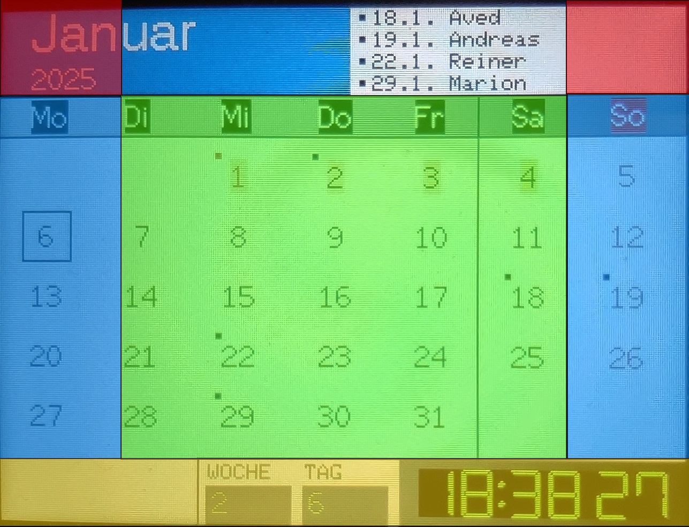

# w_Display_CYD
A calendar on a CYD (ESP32-Cheap-Yellow-Display)

[English Version](README.en.md)

## Kalender auf einem ESP32-Cheap-Yellow-Display:
Dieses Projekt basiert auf Arduino und läuft auf einem ESP32 Mikrocontroller.  
Es ist sehr einfach aufzubauen, da das Projekt fertige Komponenten verwendet,  
die ohne Lötarbeiten umgesetzt werden können.

## Lizenz:
Dieses Projekt basiert auf der MIT License (Non-Commercial):  
Copyright (c) 2025 7soft  
  
Permission is hereby granted, free of charge, to any person obtaining a copy  
of this software and associated documentation files (the "Software"), to deal  
in the Software without restriction, including without limitation the rights  
to use, copy, modify, merge, publish, distribute, sublicense, and/or sell  
copies of the Software, subject to the following conditions:  
  
The above copyright notice and this permission notice shall be included in all  
copies or substantial portions of the Software.  
  
**Non-Commercial Clause:**  
The Software may not be used for commercial purposes.   
Commercial purposes include, but are not limited to, selling or licensing the Software or any derivative works thereof for a fee, or using the Software to provide services for a fee.  
  
THE SOFTWARE IS PROVIDED "AS IS", WITHOUT WARRANTY OF ANY KIND, EXPRESS OR  
IMPLIED, INCLUDING BUT NOT LIMITED TO THE WARRANTIES OF MERCHANTABILITY,  
FITNESS FOR A PARTICULAR PURPOSE AND NONINFRINGEMENT. IN NO EVENT SHALL THE  
AUTHORS OR COPYRIGHT HOLDERS BE LIABLE FOR ANY CLAIM, DAMAGES OR OTHER  
LIABILITY, WHETHER IN AN ACTION OF CONTRACT, TORT OR OTHERWISE, ARISING FROM,  
OUT OF OR IN CONNECTION WITH THE SOFTWARE OR THE USE OR OTHER DEALINGS IN THE  
SOFTWARE.

## Funktionen:
 - Anzeige der Feiertage.
 - Anzeige von Geburtstagen oder anderen Jahrestagen.
 - Anzeige von Schulferien.
 - Konfiguration über config.txt File auf eine Mikro SD Karte.
 - Anzeige einer Uhr mit Sonnen-Aufgang und -Untergang.
 - Frei konfigurierbar auch für andere Zeitzonen und Standorte (SD-Karte).

  

## Hardware Tutorial:
- https://randomnerdtutorials.com/cheap-yellow-display-esp32-2432s028r/
- https://randomnerdtutorials.com/esp32-cheap-yellow-display-cyd-pinout-esp32-2432s028r/
- https://github.com/paelzer/ESP32-Cheap-Yellow-Display-Documentation-DE
- https://github.com/witnessmenow/ESP32-Cheap-Yellow-Display

   
 

## Arduino Library:
- SPI.h  
Ist für die Kommunikation mit der SPI Schnittstelle notwendig um das Display anzusprechen.
- XPT2046_Touchscreen.h  
Library um mit dem Touchscreen zu kommunizieren.
- TFT_eSPI.h  
Grapfik Library um das LCD Display zu steuern.

## Konfiguration der TFT_eSPI.h Library:
Die Library kann für verschiedene Typen von Displays eingesetzt werden.  
Das Cheap-Yellow-Display gibt es in zwei unterschiedlichen Varianten, mit leicht unterschiedlichen Displays.  
Daher ist es notwendig, die Library vor dem Compilieren anzupassen.

### Variante mit einer USB Schnittstelle (USB-2.0-Micro-Buchse)
In diesem Fall muss die User_Setup_USB1.h in User_Setup.h umbenannt und dann in das libraries\TFT_eSPI kopiert werden.

### Variante mit zwei USB Schnittstelle (USB-2.0-Micro-Buchse + USB-3.1-Typ-C-Buchse)
In diesem Fall muss die User_Setup_USB2.h in User_Setup.h umbenannt und dann in das libraries\TFT_eSPI kopiert werden.

## Benutzer Konfiguration des Kalenders/Uhr:
Um die Konfiguration des Kalenders/Uhr möglichst einfach zu gestalten, wird diese auf einer SD Karte hinterlegt.  
Auf der SD Karte muss die Datei config.txt gespeichert werden.  
Diese enthält dann folgede Einstellungen:

### ssid=
Die SSID des WiFi Netzwerkes.
### password=
Das Passwort des WiFi Netzwerkes.
### tzinfo=
Die Zeitzone und Sommer-/Winterzeit Infos, um die lokale Zeit des Standortes zu ermitteln.  
[Beispiele](tzinfo.txt)
### ntpserver=
Der NTP Zeitserver, von welchem die genaue aktuelle Zeit ermittelt wird.
### tformat=
Anzeige der Uhrzeit im 12 oder 24 Stunden Format. (12/24)
### brightness=
Die Start-Helligkeit der Display Hintergrundbeleuchtung. (0-255)
### function=
Mit welcher Anzeige soll die Software beginnen. (0: Kalender, 1: Uhr)
### latitude=
Breitengrad des Standorts, um den Sonnenauf und -Untergang zu ermitteln.
### longitude=
Längengrad des Standorts, um den Sonnenauf und -Untergang zu ermitteln.
### WeekDays=
Auflistung der Wochentage um diese an eine andere Sprache anzupassen.
### MonthName=
Auflistung der Monatstage um diese an eine andere Sprache anzupassen.
### Translate=
Eine weitere Auflistung von Anzeigen um diese an eine andere Sprache anzupassen. 
### birthday=
Die Geburtstagsliste. (Datum-Name,...)
### Year=
Die in der Konfiguration gespeicherten Jahreslisten. Es müssen immer 3 aufeinander folgende Jahre sein. (Jahr0,Jahr1,Jahr2)
### holiday0=
Liste der Feiertage für das Jahr0. (Datum-Beschreibung,...)
### holiday1=
Liste der Feiertage für das Jahr1. (Datum-Beschreibung,...)
### holiday2=
Liste der Feiertage für das Jahr2. (Datum-Beschreibung,...)
### schoolhol0=
Liste der Schulferien für das Jahr0. (Datum,...) 
### schoolhol1=
Liste der Schulferien für das Jahr1. (Datum,...)
### schoolhol2=
Liste der Schulferien für das Jahr2. (Datum,...)

## Touch Bedienung:
   
### GRÜN
Wechselt zur Kalender Ansicht auf aktuellen Monat.
### BLAU
Wechselt zum nächsten Kalender Monat schrittweise rauf oder runter.
### GELB
Wechselt zur Uhr Ansicht.
### ROT
Stellt die Display Hintergrund Beleuchtung ein.

## YouTube Link:
https://www.youtube.com/watch?v=C9uFmEZfyEc

## ESP Web Tools:
Mit diesem Web Tool kann das CYD mit der aktuellen Firmware geflasht werden.   
Bitte wähle USB1 für die HW Variante mit einer USB Schnittstelle und USB2 für die Variante mit zwei USB Schnittstellen.  
[Flash mit ESP Web Tools](https://7soft.de/esp_w_display_cyd/flash_x.html)
