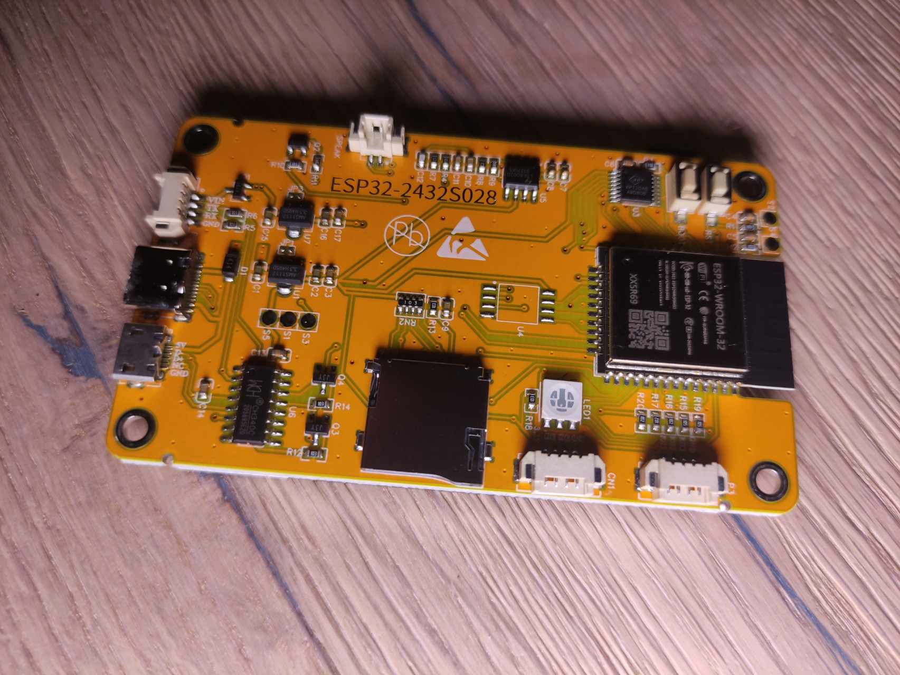

# w_Display_CYD
A calendar on a CYD (ESP32-Cheap-Yellow-Display)

## Kalender auf einem ESP32-Cheap-Yellow-Display:
Dieses Projekt basiert auf Arduino und läuft auf einem ESP32 Mikrocontroller.  
Es ist sehr einfach aufzubauen, da das Projekt fertige Komponenten verwendet,  
die ohne Lötarbeiten umgesetzt werden können.

## Funktionen:
 - Anzeige der Feiertage.
 - Anzeige von Geburtstagen oder anderen Jahrestagen.
 - Anzeige von Schulferien.
 - Konfiguration über config.txt File auf eine Mikro SD Karte.
 - Anzeige einer Uhr mit Sonnen-Aufgang und -Untergang.
 - Frei konfigurierbar auch für andere Zeitzonen und Standorte (SD-Karte).

  

## Hardware Tutorial:
- https://randomnerdtutorials.com/cheap-yellow-display-esp32-2432s028r/
- https://randomnerdtutorials.com/esp32-cheap-yellow-display-cyd-pinout-esp32-2432s028r/

   
 

## Arduino Library:
- SPI.h  
Ist für die Kommunikation mit der SPI Schnittstelle notwendig um das Display anzusprechen.
- XPT2046_Touchscreen.h  
Library um mit dem Touchscreen zu kommunizieren.
- TFT_eSPI.h  
Grapfik Library um das LCD Display zu steuern.

## Konfiguration der TFT_eSPI.h Library:
Die Library kann für verschiedene Typen von Displays eingesetzt werden.  
Das Cheap-Yellow-Display gibt es in zwei unterschiedlichen Varianten, mit leicht unterschiedlichen Displays.  
Daher ist es notwendig, die Library vor dem Compilieren anzupassen.

### Variante mit einer USB Schnittstelle (USB-2.0-Micro-Buchse)
In diesem Fall muss die User_Setup_USB1.h in User_Setup.h umbenannt und dann in das libraries\TFT_eSPI kopiert werden.

### Variante mit zwei USB Schnittstelle (USB-2.0-Micro-Buchse + USB-3.1-Typ-C-Buchse)
In diesem Fall muss die User_Setup_USB2.h in User_Setup.h umbenannt und dann in das libraries\TFT_eSPI kopiert werden.
